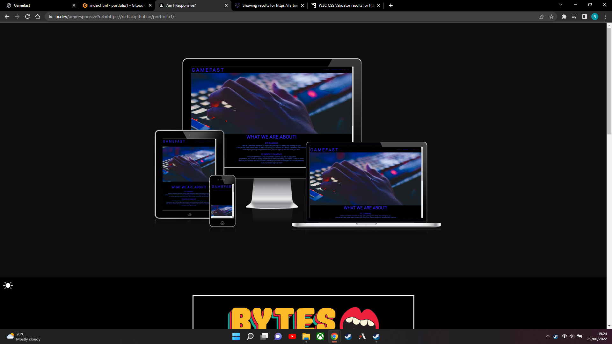
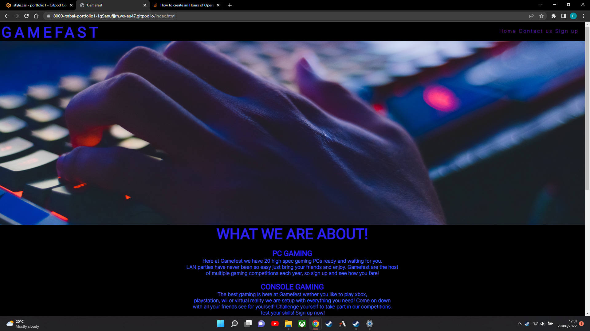
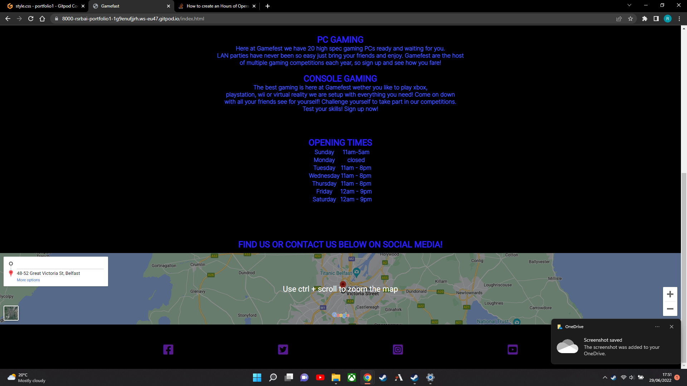
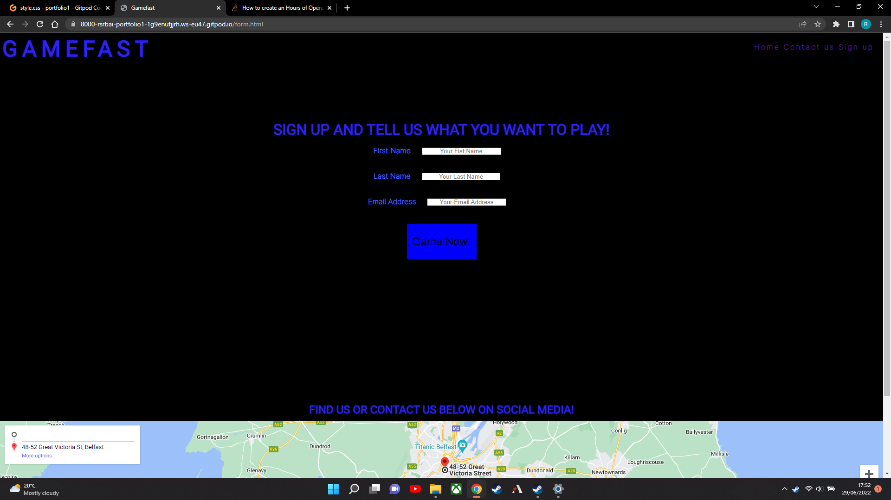
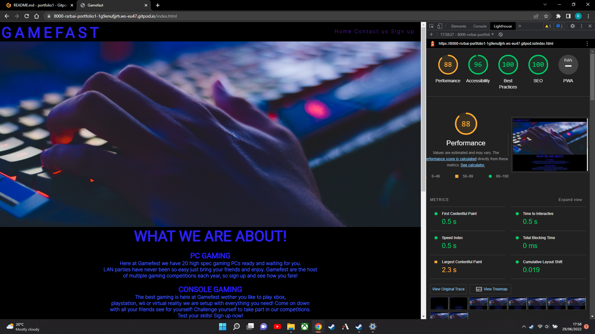
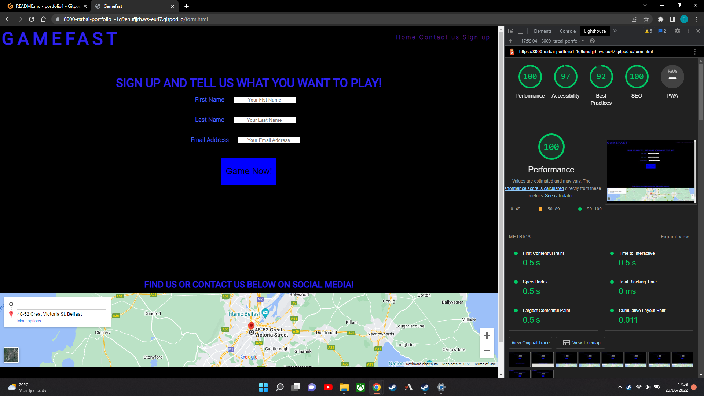
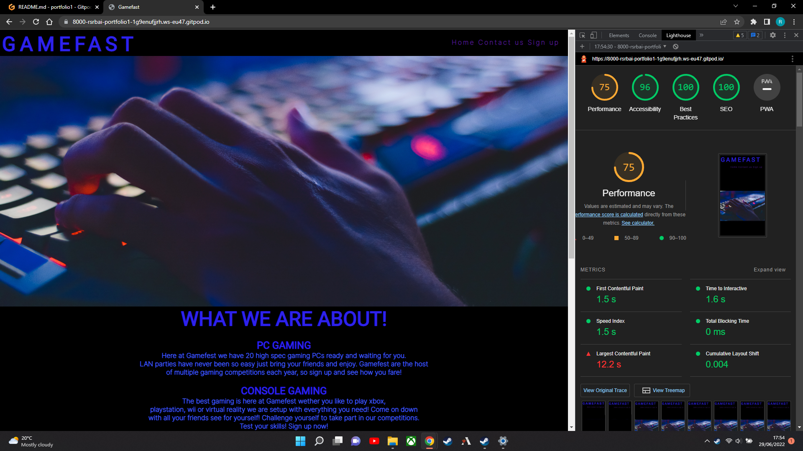
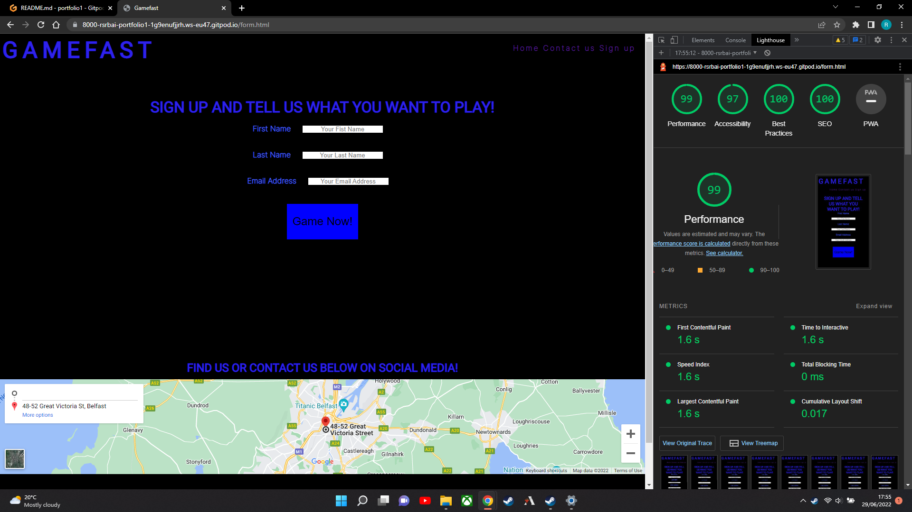

# Gamefast
 
Gamefast is a website aimed at all genre of video gamers, from console to pc. Gamefast provides high spec computers and gaming consoles to groups or indiviuals for LAN and online gaming.

On this website users will find all information needed about the club including opening times, google maps location, social media contacts, and the ability to register for competitions.

## Main Page

In the navigation bar we have our gaming Club Name as a link to the homepage and on the right three navigation buttons to take you to the contacts at the bottom and to our sign up page.
We have a hero image of a hand connecting with a keyboard sure to give any gamer the urge to game. We then have the about section telling our users what we are here to do and 
the products we can provide.

## Opening times and contacts

At the bottom of the page we have our section for opening times and days. An iframe is also provided showing our location and our social media links are provided below the map.

## Sign up page

Here we have our sign up page with a form to register for competitions and radio buttons placed to give us a good idea of which products are the most popular.

## Bugs

### Bug Fixes
- Bug 1 was fixed by using a div rather than a section
- Bug 2 and 5 was fixed by removing the h2 heading from inside the paragraphs to before the paragraph.
- Bug 3 and 4 was fixed by removing the id tags altogether, these were inserted while experimenting with my code and I forgot to remove them, I also had to remove style rules for #about_p1 and #about_p2 as they were also left over from the previous experimenting.
- Bug 6 was fixed by removing the width="100%" from the iframe in html and styling the iframe in css to width=100%
- Bug 7 and 8 was fixed by making these headers and I believe I changed some others also to h2 rather than h1 as while looking over it I should have given them the h2 heading to start with

This bug was fixed the same way as bug 6 was fixed in the previous image. I copied the page over to avoid rewriting it but also copied this bug along with it and didnt fix it while addressing the bug in the previous image.

## W3C and Jigsaw validation

## Lighthouse results

Below are the lighthouse results for the main page and sign up page on desktop

Here are the lighthouse results for mobile

## Deployment

I deployed the page using Github by opening the repository and selecting settings I then selected pages on the left hand side and within that selected the main branh and clicked save, the page then is loaded and published.

[Click here to go to the published website](https://rsrbai.github.io/portfolio1/)

## Credits

[Image of table source](assets/images/table_source.png)

I used this course on [Stackflow](https://stackoverflow.com/questions/37738278/how-to-create-an-hours-of-operation-list-with-html-and-css) as a template for my opening times and days

I also used code from love running for the form and the social media links. 
